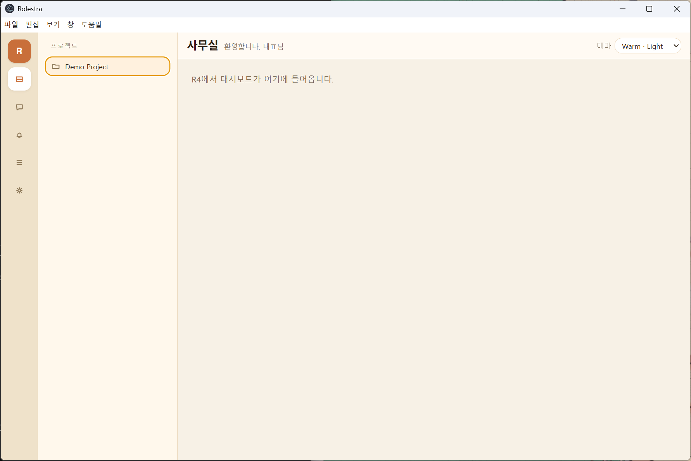
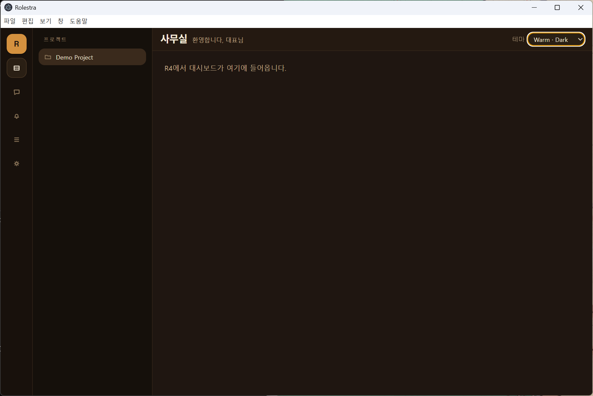
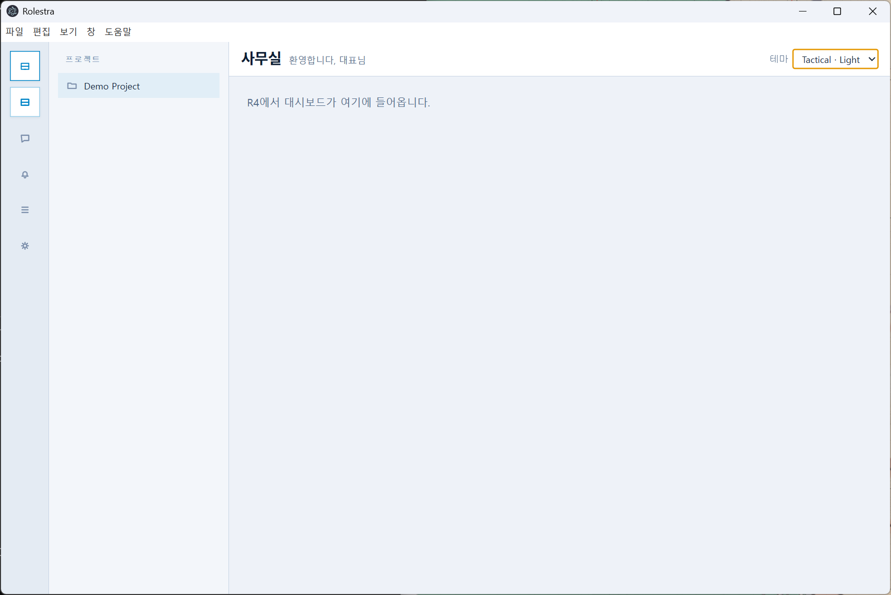
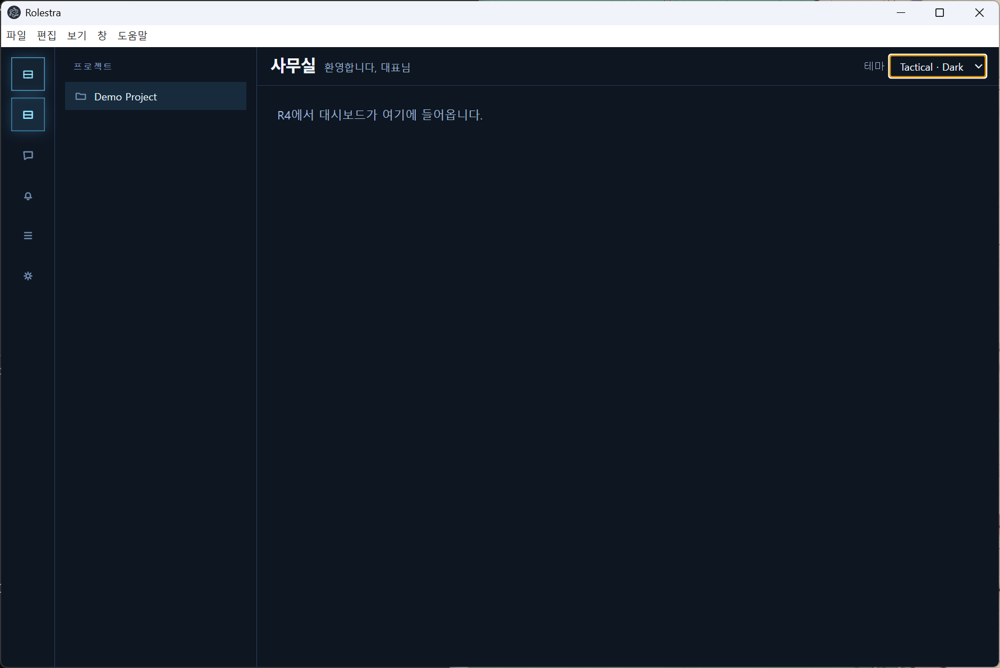
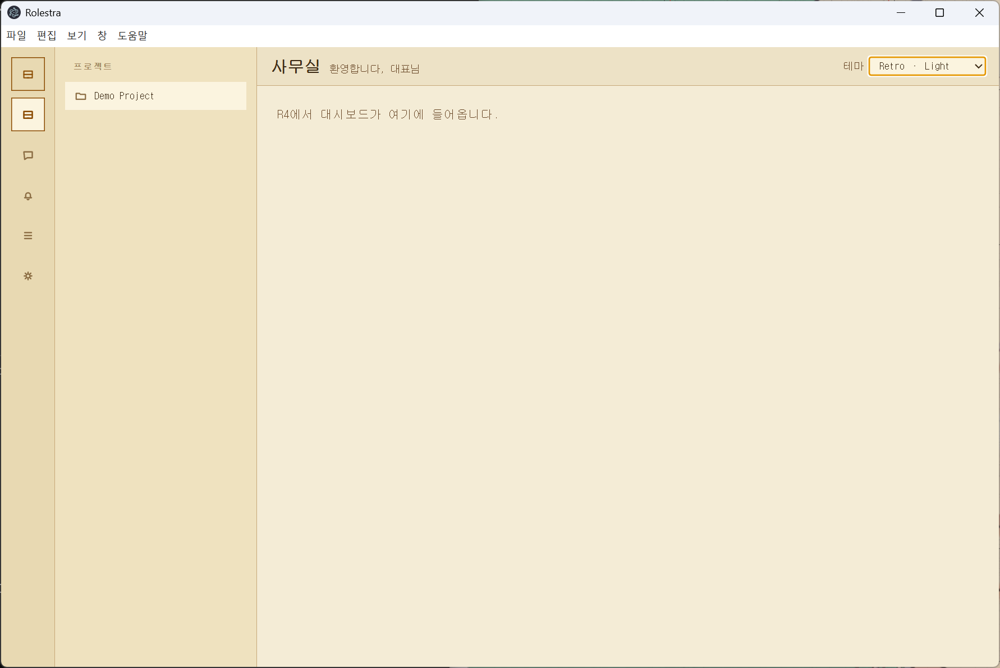
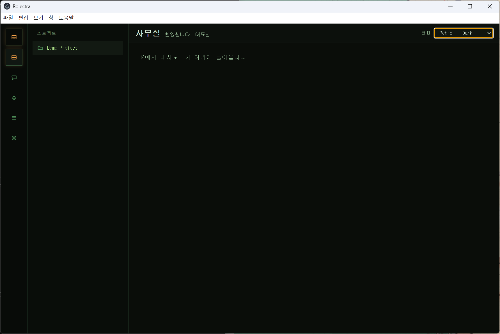

# Appendix — R3 Visual Evidence

6 테마 × 2 모드 스크린샷. 2026-04-20 실제 Electron 런타임에서 DevThemeSwitcher(우상단, DEV 전용)로 전환하며 캡처.

| Theme | Light | Dark |
|---|---|---|
| Warm   |        |        |
| Tactical |  |  |
| Retro  |      |      |

## 관찰

- Shell 레이아웃(NavRail 64px + ProjectRail 240px + ShellTopBar + 메인 슬롯)이 6 조합 전부 동일 — 테마는 시각만 바꾸고 정보 밀도 유지 (spec §7.10.8 준수).
- `data-theme` / `data-mode` 속성이 각 조합에서 tokens.css의 CSS variable 블록을 활성화 — Warm의 amber, Tactical의 cool gray/cyan, Retro의 sepia/green 각 정체성 보존.
- ShellTopBar 문구 "사무실 / 환영합니다, 대표님" — 한 줄, 마케팅 카피 없음.
- 우상단 DevThemeSwitcher — dev 빌드 전용(`import.meta.env.DEV` 가드). 프로덕션 빌드에서는 Vite DCE로 제거됨.

## 재현

```powershell
npm run dev
```

Electron window 우상단 "테마 [ Warm · Light ▾ ]" 드롭다운에서 6 조합 선택.
